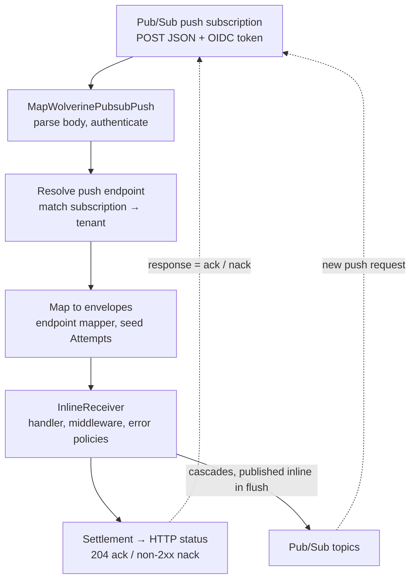

# Push Delivery (Cloud Run)

Push delivery lets Google Cloud Pub/Sub call your service over HTTP and has Wolverine process each message inside
that request. It is meant for [Serverless](/guide/serverless) hosts, and in particular for Cloud Run with
request-based billing.

## When to use push delivery

Cloud Run's default billing setting is request-based billing. A container only gets CPU while an HTTP request is in
flight, and CPU is disabled or severely limited outside requests. A streaming-pull listener, and every other
background loop, stalls between requests. Pub/Sub has to call the service instead, and the message has to be
processed before the response is written.

If you can use Cloud Run's instance-based billing, CPU stays available between requests and the normal pull
[listeners](/guide/messaging/transports/gcp-pubsub/listening) keep working. Push delivery is for the case where
request-based billing is required.

Push delivery is a delivery mode of a Pub/Sub endpoint, not a separate transport. It has these restrictions:

* It runs only with `DurabilityMode.Serverless`, so there is no message store, inbox or outbox.
* It runs only on the default Pub/Sub broker (`UsePubsub()`), not on named brokers.
* Cascaded messages are not run in the request. Every cascaded message needs an explicit external route, for example
  a Pub/Sub topic, and is handled as its own push request.

## Setup

Push delivery needs the `WolverineFx.Pubsub.AspNetCore` package in addition to `WolverineFx.Pubsub`. The ASP.NET Core
package maps the route that receives the push requests and does not depend on `Wolverine.Http`.

<!-- snippet: sample_pubsub_push_delivery -->
<a id='snippet-sample_pubsub_push_delivery'></a>
```cs
var builder = WebApplication.CreateBuilder();

builder.Host.UseWolverine(opts =>
{
    // Push delivery only runs in Serverless mode: no background agents, every endpoint Inline
    opts.Durability.Mode = DurabilityMode.Serverless;

    opts.UsePubsub("my-project")
        .AutoProvision()

        // Without a dead letter destination, MoveToErrorQueue acknowledges and drops failed messages
        .EnableDeadLettering()

        .ConfigurePushDelivery(push =>
        {
            // The Cloud Run service URL. AutoProvision writes {BaseUrl}/_wolverine/pubsub/{endpoint}
            // into each push subscription
            push.BaseUrl = builder.Configuration["PUBSUB_PUSH_BASE_URL"];
            push.ServiceAccountEmail = "pubsub-push@my-project.iam.gserviceaccount.com";

            // Cloud Run deployed with --no-allow-unauthenticated checks the token for us
            push.TrustCloudRunIam();
        });

    opts.ListenToPubsubTopic("orders").UsePushDelivery();

    // Every cascaded message needs an external route in Serverless mode
    opts.PublishMessage<OrderShipped>().ToPubsubTopic("order-shipped");
});

var app = builder.Build();

// From WolverineFx.Pubsub.AspNetCore
app.MapWolverinePubsubPush();

await app.RunAsync();
```
<sup><a href='https://github.com/JasperFx/wolverine/blob/main/src/Transports/GCP/Wolverine.Pubsub.Tests/DocumentationSamples.cs#L39-L78' title='Snippet source file'>snippet source</a> | <a href='#snippet-sample_pubsub_push_delivery' title='Start of snippet'>anchor</a></sup>
<!-- endSnippet -->

`UsePushDelivery()` is also available on `ListenToPubsubSubscription(...)` for existing, infrastructure-managed
subscriptions. `UsePushDelivery(p => ...)` can override `ServiceAccountEmail` and `Audience` for one endpoint. `BaseUrl`,
`RoutePrefix` and the authentication mode are transport-wide, because one route serves every endpoint.

Call `MapWolverinePubsubPush()` once; a second call throws. It returns an `IEndpointConventionBuilder`, so conventions such as `RequireAuthorization()` or
rate limiting can be added to it. It reads `RoutePrefix` from the transport, so the provisioned URL and the mapped
route use the same prefix.

`ConfigurePushDelivery()` also sets `Durability.UseSyncRetryBlock`, so a failed outgoing send is retried on the
request's thread and not on a background thread that gets no CPU between requests.

### Startup validation

The host fails to start, before any call to Pub/Sub, when:

* `Durability.Mode` is not `Serverless`.
* The push endpoint is on a named broker.
* No authentication mode is chosen.
* `AutoProvision()` is on and there is no `BaseUrl`.
* `RoutePrefix` is empty.
* `BaseUrl` is not `https`, unless the mode is `AllowUnauthenticated()`.
* The endpoint uses `SubscriptionPerNode()`, because Cloud Run instances are not individually addressable.
* The endpoint enables exactly-once delivery, which Pub/Sub supports for pull subscriptions only.
* The endpoint uses `CircuitBreaker(...)`.
* `VerifyOidcToken()` is chosen with neither `Audience` nor `BaseUrl`, or without `ServiceAccountEmail`.

Wolverine logs a warning, without failing, when:

* A push endpoint has neither a Wolverine dead letter topic nor a subscription dead-letter policy.
* Requeue policies exist and the subscription has no dead-letter policy. This check runs only when Wolverine can see
  the subscription's configuration.
* `AllowUnauthenticated()` is used.
* Push endpoints are configured and `MapWolverinePubsubPush()` was never called.

## How a push request is processed



Pub/Sub sends `POST {RoutePrefix}/{endpointName}` with a JSON body that wraps the message:

```json
{
  "message": { "data": "base64", "attributes": { }, "messageId": "…", "publishTime": "…", "orderingKey": "…" },
  "subscription": "projects/{project}/subscriptions/{subscription}",
  "deliveryAttempt": 3
}
```

* The route finds the push endpoint whose `EndpointName` matches. The name defaults to the topic name, and the
  provisioned URL uses the URL-encoded name.
* The `subscription` in the body must be the endpoint's subscription in the default project or in a tenant project.
* The message is rebuilt and mapped with the endpoint's normal envelope mapper. The `batched` attribute is handled
  as in the pull listener.
* If `deliveryAttempt` is present, it seeds the envelope's `Attempts`, so error policies count across redeliveries.
* The handler, its middleware, its error policies and its outgoing Pub/Sub publishes complete before the response is
  written.
* `HttpContext.RequestAborted` is passed to the handler as its cancellation token. When the request is abandoned,
  failure policies do not run, and the request is answered 503 whatever the handler recorded.
* A message that cannot be mapped is acknowledged and logged, and the raw message is published to the Wolverine
  dead letter topic if one is configured.

### Tenants

A request whose subscription belongs to a tenant project (`AddTenant`) gets that tenant's id stamped on the envelope.
This happens before the endpoint's own incoming rules, as in pull mode, so an explicit `TenantId` on the endpoint wins.

## Authentication and IAM

The authentication mode must be set explicitly. There is no default.

| Mode | Use case | What the app checks |
|---|---|---|
| `TrustCloudRunIam()` | Cloud Run with `--no-allow-unauthenticated`, with `roles/run.invoker` granted to the push service account | No cryptographic check. Cloud Run checks the token and the invoker role before the request reaches the container. If `ServiceAccountEmail` is set, the `email` claim of the forwarded `Authorization` token is decoded without verifying it and compared. Google does not document whether Cloud Run forwards that header intact, so the comparison is best-effort and is skipped when the header is missing or cannot be decoded. A mismatch returns 403. |
| `VerifyOidcToken()` | Services that allow unauthenticated calls, GKE, other hosts | The token's signature, both issuer forms, `aud` equal to `Audience`, `email` equal to `ServiceAccountEmail`, and `email_verified`. A missing or invalid token returns 401. A valid token for another principal returns 403. |
| `AllowUnauthenticated()` | Pub/Sub emulator, tests | Nothing. Logs a warning at startup. |

Using `VerifyOidcToken()` together with Cloud Run IAM has not been verified against a real Cloud Run service. Google
documents signature removal on Cloud Run only for the `X-Serverless-Authorization` header, and Pub/Sub sends
`Authorization`.

### Audience

* If a subscription has no audience, Pub/Sub uses the push endpoint URL, including its path.
* Cloud Run accepts only the service URL or a configured custom audience as `aud`. Google does not document whether a
  URL with a path is accepted.
* Wolverine's push URLs always have a path, so `Audience` defaults to `BaseUrl`, the service URL. This applies to
  provisioning and to `VerifyOidcToken()`.
* Without `BaseUrl`, that is without `AutoProvision()`, `VerifyOidcToken()` requires an explicit `Audience`.
* Cloud Run does not accept custom domains as `aud`. If the service is reached through a custom domain, `Audience`
  must still be the `run.app` URL or a custom audience configured on the service.

### IAM

Wolverine documents these roles and never grants them:

* `roles/run.invoker` on the Cloud Run service, for the push service account.
* `roles/iam.serviceAccountTokenCreator` on the push service account, for the Pub/Sub service agent. This is only
  needed for projects created on or before April 8, 2021.
* Pub/Sub admin or editor roles for the runtime identity when `AutoProvision()` is used.

When push subscriptions are provisioned in tenant projects, each tenant project's Pub/Sub service agent must be allowed
to mint tokens for `ServiceAccountEmail`.

The Pub/Sub emulator does not support IAM, so none of this can be tested locally.

## Provisioning

With `AutoProvision()`:

* A new subscription is created with a `PushConfig` that holds the endpoint's push URL and an `OidcToken`
  (`ServiceAccountEmail` and `Audience`). It uses the default wrapped payload, not `NoWrapper`. Every
  `ConfigurePubsubSubscription` option still applies: ack deadline, retry policy, dead-letter policy, filter, ordering
  and retention.
* The push URL is `BaseUrl + RoutePrefix + "/" + Uri.EscapeDataString(endpointName)`. `RoutePrefix` defaults to
  `/_wolverine/pubsub`. `BaseUrl` is required.
* If the subscription already exists, Wolverine reads it and calls `ModifyPushConfig` when the push config differs.
  This also converts a pull subscription to push, and Wolverine logs that at information level. This matters because the
  Cloud Run URL can change between deployments.
* The same push subscription, with the same URL, is provisioned in each tenant project.
* The dead letter topic is provisioned as before, and its subscription stays pull.
* `AutoPurgeAllQueues` uses `Seek` to the current time for push subscriptions. Google documents that this marks every
  earlier message as acknowledged, and that it is eventually consistent (up to about a minute). Test setups that
  purge should allow for that delay. Google does not document what `Pull` does on a push subscription, so Wolverine does
  not use it.

Without `AutoProvision()`, `BaseUrl` is not required and Wolverine creates and modifies nothing. Infrastructure as code
owns the subscription.

In both cases, every push endpoint reads its subscription at startup. This verifies that the subscription exists, reads
the real ack deadline and detects a missing dead-letter policy. The read needs `pubsub.subscriptions.get`. If it fails,
Wolverine logs a warning and uses the configured values.

## Acks, retries and dead letters

Pub/Sub treats 102, 200, 201, 202 and 204 as an ack and any other status as a nack. Wolverine uses 204 for every ack.
The different nack codes are for operators and logs.

| What happens | Status | What Pub/Sub does next |
|---|---|---|
| Handler succeeds | 204 | Acks the message |
| An error policy discards the message | 204 | Acks the message |
| `RetryNow` or `RetryWithCooldown` | (still running) | Nothing yet. The retry happens inside the same request |
| `Requeue` | 503 | Redelivers with the subscription's retry policy backoff. Push mode does not publish a copy, unlike pull |
| `ScheduleRetry(delay)` | 503 | Redelivers with the subscription's backoff. The requested delay is ignored |
| `MoveToErrorQueue` with a Wolverine dead letter topic | 204, after the dead-letter publish completes | Acks the message |
| The dead-letter publish fails | 500 | Redelivers |
| `MoveToErrorQueue`, no Wolverine dead letter topic, but the subscription has a dead-letter policy | 503 | Redelivers until the subscription's policy forwards the message |
| `MoveToErrorQueue` with no dead letter destination | 204, with an error log | Acks and drops the message |
| Message type with no handler | 204, logged | Acks the message |
| Duplicate inside the `WithInMemoryIdempotency` window | 204 | Acks without handling |
| An outgoing send fails after in-request retries | 500 | Redelivers, and the handler runs again |
| The handler pipeline failed and its recovery path ran | 500 | Redelivers |
| The envelope was never settled | 503 | Redelivers |
| The host is stopping or not fully started, or the request was aborted by the caller | 503 | Redelivers, possibly to another instance |
| Body is not a valid push envelope | 400 | Treats it as a nack |
| `subscription` does not belong to the endpoint | 400 | Treats it as a nack |
| Unknown endpoint name, or an endpoint in pull mode | 404 | Treats it as a nack |
| Authentication fails | 401 or 403 | Treats it as a nack |
| Message data cannot be mapped | 204, with an error log | Acks the message. The raw message also goes to the Wolverine dead letter topic if one is configured |
| Message data cannot be mapped and that dead-letter publish fails | 500 | Redelivers |

A failure is sticky. Once an envelope is recorded as failed, a later `CompleteAsync` from the pipeline's recovery path
does not turn it into an ack.

When one request carries several envelopes (the `batched` attribute), the request returns 204 only when every
envelope was completed, discarded or dead-lettered. If any envelope is nacked, the whole delivery is nacked, and
envelopes that already succeeded run again on redelivery. The status is that of the first failure recorded.

### How Pub/Sub reacts to nacks

* **Push window.** Pub/Sub decides push concurrency with a slow-start window. It grows on success and shrinks on every
  nack or timeout. A requeue (503) slows delivery for the whole subscription, not only for that message.
* **Push backoff.** After a nack or an expired deadline, Pub/Sub backs off exponentially between 100 ms and 60 s. This
  cannot be turned off or tuned.
* **Retry policy.** The subscription's retry policy (default minimum 10 s, maximum 600 s) applies on top. The effective
  delay is the larger of the two.
* **Retries never stop.** Pub/Sub redelivers until the message is acked. Only a subscription dead-letter policy
  (5 to 100 attempts) ends the loop for a message that fails every time.

### Retry counts

* Pub/Sub sends `deliveryAttempt` only when the subscription has a dead-letter policy. Without one, every delivery
  counts as attempt 1, so a policy such as "requeue 3 times, then dead-letter" never reaches 3.
* Google describes the count as best-effort even with a dead-letter policy. Wolverine's attempt-based policies are
  therefore best-effort across redeliveries, and the subscription's own dead-letter policy is the reliable stop.
* Google does not guarantee ordering when a dead-letter topic is enabled. With ordering, push allows one outstanding
  message per key, and a redelivery resends every later message for that key, including ones already acked. Choose
  between ordering and a subscription dead-letter policy for each endpoint.

### Pausing and circuit breakers

Push endpoints have no listening agent and Pub/Sub cannot be told to stop pushing. A pause continuation logs
"Unable to pause" and does nothing else, and a requeue with a pause skips the pause and defers. `CircuitBreaker(...)`
on a push endpoint fails at startup. Pub/Sub's own push backoff takes their place.

## Timeouts

For a push subscription, the ack deadline is also the HTTP request timeout. The default is 10 s and the maximum is
600 s, and it cannot be extended per message. If processing takes longer, Pub/Sub redelivers the message, possibly to
another instance, while the first request is still running.

Cloud Run's request timeout defaults to 300 s and can be raised to 3600 s. Set it at least as high as the ack
deadline. Google's Cloud Run guide for Pub/Sub uses an ack deadline of 600 s, which needs a Cloud Run timeout of at
least 600 s.

In-request send retries and `RetryWithCooldown` delays count against the same deadline. Wolverine has no timer in the
push path, because Cloud Run gives no CPU between requests. It logs a warning after a request that took longer than the
ack deadline. The deadline used is the one read from the subscription at startup, or the configured one if that read
failed.

## What works and what doesn't

::: warning
Handlers must be idempotent. Without an outbox, a redelivery runs the handler again, including its database writes.
Cascaded messages that were already published before the failing one are published again.
:::

| Works | Not supported (clear error or documented) |
|---|---|
| Handlers, middleware, pre-generated code | Durable inbox and outbox |
| Error policies: inline retry, requeue, dead-letter, discard | Scheduled and delayed messages, `ScheduleAsync`, saga timeouts |
| `ScheduleRetry`, as a nack with the subscription's backoff | Recurring schedules (Serverless rejects them at startup) |
| Cascades routed to Pub/Sub or to another broker endpoint set to Inline | Local queues, and cascades to local handlers |
| Sagas loaded and saved by Marten or EF Core (no timeouts) | Request/reply across services over Pub/Sub |
| Marten and EF Core transactional middleware. Sends happen after commit, not atomically | Batch handlers (`BatchMessagesOf`), partitioned or sharded processing (use ordering keys) |
| Tenancy by header and by tenant project | Wolverine's stored dead letters and replay |
| Ordering keys, custom envelope mappers, batched envelopes | Leader-pinned or exclusive listeners, and agents |
| OpenTelemetry tracing and metrics. Trace context from the publisher flows through message attributes. The Wolverine spans are not children of the ASP.NET Core request span | Duplicate detection across instances (`WithInMemoryIdempotency` is per instance only), and store-backed deduplication rules |
| Wolverine.Http endpoints in the same app, with the same cascade rules | Pausing a listener, and circuit breakers |
| | Endpoint health and diagnostics that read from a listening agent |
| | `EnableAutomaticFailureAcks` replies, unless the reply has an external route |

See [Serverless](/guide/serverless#cloud-run-and-pub-sub-push) for the cascade and scheduling errors.

## Local development

Run the Pub/Sub emulator (`docker compose up -d gcp-pubsub` in the Wolverine repository uses port 8085) and connect
with `UsePubsub(...).UseEmulatorDetection()` as described on the [Pub/Sub transport page](/guide/messaging/transports/gcp-pubsub/).
Use `AllowUnauthenticated()` and an `http` `BaseUrl` that the emulator can reach. The emulator supports push
subscriptions with unencrypted endpoints and dead-letter forwarding. It supports neither IAM nor OIDC tokens nor HTTPS
endpoints, so authentication and IAM can only be tested with a fake token validator or against real Google Cloud.

## Future: durable push delivery

Durable support is not part of the first version. It would need:

* A database-backed message store with Durable endpoints.
* A durability HTTP endpoint, triggered by Cloud Scheduler, that runs one durability pass: inbox and outbox recovery,
  scheduled-message polling and cleanup.
* Durable outgoing sends that wait for the broker publish to finish before the push response is written.
* Inbox-based deduplication keyed on the Pub/Sub `messageId`.
