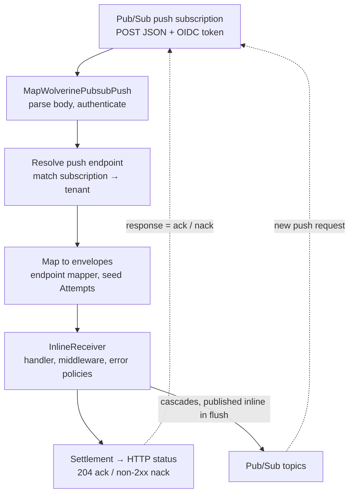

# GCP Pub/Sub push delivery for Serverless (Cloud Run) — design

- **Status:** draft for review
- **Date:** 2026-10-08
- **Branch:** `gcp-pubsub-push-spec`

## 1. Intent

### What was asked

- Add a Google Cloud Pub/Sub **push** endpoint as an alternative to pulling messages.
- Use case: Cloud Run with **request-based billing**. Containers only get CPU while an HTTP request is in flight, so a streaming-pull listener (and every other background loop) stalls between requests. Pub/Sub must call the service over HTTP, and the message must be processed inside that request.
- Cascading messages should be handled during the request where possible.
- Wolverine features must keep working, and what does not work must be documented.

### Decisions made during design

| Question | Decision |
|---|---|
| Message persistence | v1 runs **without a message store** (`DurabilityMode.Serverless`). Durable support (database-backed inbox/outbox) is documented as a future extension. |
| Durability mode | Push endpoints are supported **only** in `DurabilityMode.Serverless`. |
| Cascades to local handlers | **Not executed in-request.** Every cascaded message needs an explicit external route (e.g. a Pub/Sub topic) and is processed as its own push request. A cascade that only has a local handler is an error. |
| Push subscription ownership | Both: `AutoProvision()` creates or updates the push subscription; without it Wolverine assumes infrastructure-as-code owns it. |
| Shape of the feature | A delivery mode of the existing `PubsubEndpoint` (not a separate transport), with the HTTP route in a new `WolverineFx.Pubsub.AspNetCore` package. |

### Success criteria

1. A Cloud Run service on request-based billing receives Pub/Sub messages over push and runs the handler, its middleware, its error policies and its outgoing Pub/Sub publishes before the HTTP response is written.
2. Ack/nack semantics are correct: no message is acked unless it was handled, discarded or dead-lettered, and every cascaded publish has completed.
3. Every Wolverine feature is either shown to work in push mode or fails with a clear error, and both lists are documented.
4. Pull-mode Pub/Sub users are unaffected.

## 2. Findings that shape the design

These were established by reading the code and by a throwaway test against `main` (commit `4df630825`).

1. **Serverless mode cannot cascade or publish today.** `MessageRouterBase`'s constructor always resolves `local://durable` for its scheduled-send fallback (`src/Wolverine/Runtime/Routing/MessageRouterBase.cs:36`). Serverless removes the local transport (`WolverineRuntime.HostService.cs:290-293`), so the first `RoutingFor(type)` for **any** message type throws `UnknownTransportException: There is no known transport type that can send to the Destination local://durable/`. This was reproduced for a cascade that only had a local handler and for a cascade with an explicit `ToSharedMemoryTopic` route. The comment at `WolverineRuntime.HostService.cs:331-342` claiming per-type routing "still works" is wrong.
2. **The existing pull listener already has the right shape.** `PubsubListener`'s `EndpointMode.NativeAck` path holds the Pub/Sub callback open until the pipeline settles the delivery (`src/Transports/GCP/Wolverine.Pubsub/Internal/PubsubListener.cs:427-485`). Push mode does the same thing, with an HTTP response in place of the callback's return value.
3. **Serverless already forces every endpoint to `Inline`** (`ServerlessEndpointsMustBeInlinePolicy`, `src/Wolverine/Configuration/IEndpointPolicy.cs:11`), and does not auto-start listeners (`Endpoint.ShouldAutoStartAsListener`, `Endpoint.cs:1151-1167`). With Inline, `PubsubEndpoint.CreateSender` returns `InlinePubsubSender`, so the first send attempt runs in the caller. Retries after a send failure run on a background thread unless `DurabilitySettings.UseSyncRetryBlock = true`.
4. **Failed outgoing sends are discarded.** `MessageContext.FlushOutgoingMessagesAsync` catches a send failure, logs it and discards the envelope (`src/Wolverine/Runtime/MessageContext.cs:251-261`). In push mode this would ack the incoming message after losing its cascade.
5. **`ScheduleRetry` may silently drop messages in Serverless.** With `NullMessageStore` and no in-memory scheduler (it is never created in Serverless), the reschedule fallback ends in `ScheduledJobs?.Enqueue` on a null scheduler. Not yet confirmed by a test; see §9.
6. **Local queues never run inline.** `LocalQueue.BuildReceiver` supports only Buffered and Durable, and nothing tracks when cascaded local work has finished. This is why local cascades are out of scope.

## 3. Architecture

### 3.1 Components

**`WolverineFx.Pubsub` (existing package; no ASP.NET Core dependency)**

- `PubsubEndpoint` gains:
  - `DeliveryMode`: `Pull` (default) or `Push`.
  - `Push`: per-endpoint `PubsubPushOptions` overrides.
- `PubsubTransport` gains transport-wide push settings (`ConfigurePushDelivery(...)`): `BaseUrl`, `RoutePrefix`, `ServiceAccountEmail`, `Audience`, authentication mode.
- `PubsubPushProcessor`: processes one parsed delivery and returns an outcome. Its input is a `PubsubMessage`, the `subscription` name and the optional `deliveryAttempt`; its output is `Ack`, `Nack(reason)` or `Reject(reason)`. It has no HTTP types, so it is unit-testable without ASP.NET Core.
- `PubsubPushDelivery`: a per-request object that plays the listener role. It implements `IListener`, `ISupportDeadLetterQueue`, `ISupportNativeScheduling` and the new outgoing-failure interface (§6.3), and records how the pipeline settled each envelope.
- Startup validation (§5.4).

**`WolverineFx.Pubsub.AspNetCore` (new package)**

- `IEndpointRouteBuilder.MapWolverinePubsubPush()`: maps one `POST {RoutePrefix}/{endpointName}` route and returns the endpoint convention builder.
- Reads and parses the push JSON body.
- Authenticates the request (§5.3).
- Calls `PubsubPushProcessor` and writes the status code.
- Depends on `Microsoft.AspNetCore.App` (framework reference) and `Wolverine.Pubsub`, **not** on `Wolverine.Http`.

`WolverineFx.Pubsub` stays usable in worker images built on the plain .NET runtime image, which has no ASP.NET Core runtime.

### 3.2 Request flow



1. Pub/Sub sends `POST {RoutePrefix}/{endpointName}` with the standard wrapped body:
   ```json
   {
     "message": { "data": "base64", "attributes": { }, "messageId": "…", "publishTime": "…", "orderingKey": "…" },
     "subscription": "projects/{project}/subscriptions/{subscription}",
     "deliveryAttempt": 3
   }
   ```
   The parser also accepts the snake_case aliases Pub/Sub sends (`message_id`, `publish_time`). `deliveryAttempt` is optional.
2. The route finds the `PubsubEndpoint` in `Push` mode whose `EndpointName` matches `{endpointName}`. An unknown name, or an endpoint in pull mode, returns **404**.
3. `subscription` must equal the endpoint's subscription in the default project (`SubscriptionNameFor(transport.ProjectId)`) or in a tenant project (`SubscriptionNameFor(tenant.ProjectId)`).
   - A tenant-project match stamps that tenant's id, the same way the pull-side `TenantIdRule` does.
   - A mismatch returns **400**.
4. The body is rebuilt as a `Google.Cloud.PubSub.V1.PubsubMessage` and mapped with the endpoint's normal `IPubsubEnvelopeMapper`.
   - The `batched` attribute is honoured exactly as in `PubsubListener.readEnvelopes`.
   - A mapping failure is acked (**204**) with an error log, and the raw message is published to the dead-letter topic if one is configured. Nacking it would only redeliver a message that can never be read.
5. If `deliveryAttempt` is present, `envelope.Attempts` is seeded from it so error policies count across Pub/Sub redeliveries. The exact off-by-one relationship to Wolverine's own increment is settled in the implementation plan.
6. The envelopes go to an `InlineReceiver` for the endpoint, built once at startup with the same `IHandlerPipeline` a `ListeningAgent` would build for that endpoint. The handler, its middleware, its error policies and its outgoing inline sends all complete before `ReceivedAsync` returns.
7. `PubsubPushDelivery`'s recorded outcome becomes the HTTP status (§4).

`HttpContext.RequestAborted` is passed through as the pipeline's cancellation token.

## 4. Settlement, errors and HTTP status codes

| What the pipeline does | Status | What Pub/Sub does next |
|---|---|---|
| Handler succeeds (`CompleteAsync`) | 204 | Acks the message |
| Error policy discards the message | 204 | Acks the message |
| `RetryNow` / `RetryWithCooldown` | (still running) | Nothing yet; the retry happens inside the same request |
| `Requeue` (`DeferAsync` / `TryRequeueAsync`) | 503 | Redelivers with the subscription's `RetryPolicy` backoff. Push mode does **not** republish a copy (unlike pull). |
| `ScheduleRetry(delay)`, through `ISupportNativeScheduling` | 503 | Redelivers with the subscription's backoff. The requested delay is ignored, and the docs say so. |
| `MoveToErrorQueue` with a dead-letter topic | 204, once the dead-letter publish has completed | Acks the message. Failure metadata is stamped as in `PubsubListener.MoveToErrorsAsync`, but the publish is awaited in-request instead of going through a `RetryBlock`. |
| The dead-letter publish fails | 500 | Redelivers |
| `MoveToErrorQueue` with dead-lettering disabled | 204, with an error log | Acks the message. The docs recommend a subscription `DeadLetterPolicy` plus requeue-based policies for native dead-lettering instead. |
| An outgoing send fails, after in-request retries (§6.3) | 500 | Redelivers; the handler runs again |
| An exception escapes the receiver | 500 | Redelivers |
| Listener paused, or circuit breaker open | 503 | Redelivers later. The pause is stored as a "paused until" time and checked per request, not resumed by a timer. |
| Host stopping, or not fully started | 503 | Redelivers, possibly to another instance |
| Body is not a valid push envelope | 400 | Treats it as a nack |
| `subscription` does not match the endpoint | 400 | Treats it as a nack |
| Unknown endpoint name, or endpoint in pull mode | 404 | Treats it as a nack |
| Authentication fails (§5.3) | 401 or 403 | Treats it as a nack |
| Message data cannot be mapped | 204, with an error log | Acks the message; also goes to the dead-letter topic if configured |

Pub/Sub treats 102, 200, 201, 202 and 204 as an ack and any other status as a nack. Wolverine uses 204 for every ack. The different nack codes exist only for operators and logs.

### Retry counts

- Pub/Sub sends `deliveryAttempt` only when the subscription has a dead-letter policy. Without one, every delivery counts as attempt 1, so "requeue N times, then dead-letter" never reaches N.
- At startup, Wolverine logs a warning for any push endpoint that uses requeue or scheduled-retry policies on a subscription without a dead-letter policy. This check runs only when Wolverine can see the subscription's configuration: under `AutoProvision()`, or by reading the existing subscription.

### Batched deliveries

When one push request carries several envelopes (the `batched` attribute):

- The request returns 204 only when every envelope has been completed, discarded or dead-lettered.
- If any envelope is nacked, the whole delivery is nacked, and envelopes that already succeeded run again on redelivery.
- This is the same at-least-once behaviour as `NativeAck` (`PubsubHeldDeliveries`), and it is documented.

### Time limits

- If processing outlives the subscription's ack deadline (at most 600 s), Pub/Sub may redeliver the message to another instance while the first is still running.
- The processor tracks each request the way `AckExtensionWatchdog` does and logs a warning when a request outlives the ack deadline.
- The docs say that Cloud Run's request timeout must be at least the ack deadline.

## 5. Configuration, provisioning and authentication

### 5.1 Configuration API

```csharp
builder.Host.UseWolverine(opts =>
{
    opts.Durability.Mode = DurabilityMode.Serverless;

    opts.UsePubsub("my-project")
        .AutoProvision()
        .ConfigurePushDelivery(push =>
        {
            push.BaseUrl = builder.Configuration["PUBSUB_PUSH_BASE_URL"]; // https://orders-abc.a.run.app
            push.RoutePrefix = "/_wolverine/pubsub";                      // default
            push.ServiceAccountEmail = "pubsub-push@my-project.iam.gserviceaccount.com";
            push.Audience = "https://orders-abc.a.run.app";               // optional, see §5.3
            push.TrustCloudRunIam();   // or VerifyOidcToken() / AllowUnauthenticated()
        });

    opts.ListenToPubsubTopic("orders")
        .UsePushDelivery();            // optional per-endpoint overrides: .UsePushDelivery(p => ...)

    opts.PublishMessage<OrderShipped>().ToPubsubTopic("order-shipped");
});

var app = builder.Build();
app.MapWolverinePubsubPush();          // POST /_wolverine/pubsub/{endpointName}
```

- Each endpoint's push URL is `BaseUrl + RoutePrefix + "/" + endpointName`.
- `MapWolverinePubsubPush()` reads `RoutePrefix` from the transport, so the provisioned URL and the mapped route cannot drift apart.
- `MapWolverinePubsubPush()` returns an `IEndpointConventionBuilder`, so `.RequireAuthorization()`, rate limiting and similar conventions compose with it.
- `UsePushDelivery()` is also available on `ListenToPubsubSubscription(...)` for existing, infrastructure-managed subscriptions.

### 5.2 Provisioning

**With `AutoProvision()`:**

- **New subscription.** Created with:
  - a `PushConfig` containing the endpoint's push URL and an `OidcToken` (`ServiceAccountEmail`, `Audience`);
  - the default wrapped payload, not `NoWrapper`;
  - every existing `ConfigurePubsubSubscription` option (ack deadline, retry policy, dead-letter policy, filter, ordering, retention).
- **Existing subscription.** `CreateSubscription` returning `AlreadyExists` is no longer the end of it for push endpoints:
  - Wolverine calls `GetSubscription`, and if the push config differs, calls `ModifyPushConfig`.
  - This also converts a pull subscription to push, which is logged at information level.
  - It matters because the Cloud Run URL can change between deployments.
- **Tenant projects.** The same push subscription, with the same URL, is provisioned in each tenant project.
- **Dead-letter topic.** Provisioned as today; its subscription stays pull.
- **Purge.** `AutoPurgeAllQueues` uses `Seek` to the current time for push subscriptions, because `Pull` on a push subscription fails.

**Without `AutoProvision()`:**

- `BaseUrl` is not required.
- Wolverine only checks that the subscription exists, the same check `IsExistingSubscription` already makes.

### 5.3 Authentication

The authentication mode must be set explicitly; there is no silent default.

| Mode | Use case | What the app checks |
|---|---|---|
| `TrustCloudRunIam()` | Cloud Run with `--no-allow-unauthenticated`, with `roles/run.invoker` granted to the push service account | No cryptographic check; the platform has already validated the token. If `ServiceAccountEmail` is set and the forwarded token carries an `email` claim, that claim must match. |
| `VerifyOidcToken()` | Services that allow unauthenticated calls, GKE, other hosts | `GoogleJsonWebSignature.ValidateAsync` (Google.Apis.Auth, already a transitive dependency through Gax): signature, issuer, `aud` equal to `Audience` (default: the endpoint's push URL), `email` equal to `ServiceAccountEmail`, `email_verified`. Google's certificates are cached. |
| `AllowUnauthenticated()` | Pub/Sub emulator, tests | Nothing. Logs a warning at startup. |

A failed check returns **401** when the token is missing or invalid, and **403** when the token is valid but for the wrong principal.

**IAM, documented but never granted by Wolverine:**

- `roles/run.invoker` on the Cloud Run service, for the push service account.
- `roles/iam.serviceAccountTokenCreator` on the push service account, for the Pub/Sub service agent (needed in older projects).
- Pub/Sub admin or editor roles for the runtime identity when `AutoProvision()` is used.

### 5.4 Startup validation

The host fails to start when:

- a push endpoint is configured and `Durability.Mode` is not `Serverless`;
- `AutoProvision()` is on and a push endpoint has no `BaseUrl`;
- a push endpoint uses `SubscriptionPerNode()`, because Cloud Run instances are not individually addressable;
- a push endpoint sets `EnableExactlyOnceDelivery`, believed to be pull-only (§9);
- no authentication mode is chosen.

It logs a warning, without failing, for:

- push endpoints using requeue or scheduled-retry policies on a subscription without a dead-letter policy (§4);
- `AllowUnauthenticated()`;
- push endpoints configured while `MapWolverinePubsubPush()` was never called. This is detected when the host has fully started.

## 6. Prerequisite changes in core Wolverine

These are needed for push mode and also fix pull-based Serverless.

### 6.1 `MessageRouterBase` resolves `local://durable` lazily

- `LocalDurableQueue` is resolved on first use, not in the constructor.
- In Serverless, a scheduled envelope whose route cannot schedule natively (`SupportsNativeScheduledSendFor` is false; Pub/Sub's inline sender always returns false) throws `InvalidOperationException` at publish time, naming the message type and destination: "scheduled or delayed delivery is not supported in Serverless mode for …".
- Because the constructor no longer touches `local://durable`, re-enable `PrepopulateRoutingCache` for Serverless (`WolverineRuntime.HostService.cs:343-347`) and remove the TODO. That is a cold-start improvement.

### 6.2 Cascades with a local handler but no route throw in Serverless

- In Serverless, `EnqueueCascadingAsync` / `PublishAsync` throws `NoRoutesForCascadingMessageException` (name to be decided in the plan) when the message has no routes but a local handler exists. The error policy runs, and in push mode the delivery is nacked.
- Today this case is logged at information level as "no routes" and the message is dropped.
- A message type with no handler and no route keeps today's behaviour.
- At startup, Serverless logs a warning listing every cascade type visible in handler return types that has a local handler and no external route.

### 6.3 Outgoing send failures can fail the delivery

- New optional interface in core, implemented by the channel (listener) the message arrived on. Working name: `IObserveOutgoingSendFailures`.
- `MessageContext.FlushOutgoingMessagesAsync` calls it in its existing catch block, before discarding.
- `PubsubPushDelivery` implements it: a failed outgoing send marks the delivery failed, and the request returns **500**.
- When any push endpoint is configured, push mode turns on `DurabilitySettings.UseSyncRetryBlock`, so `InlineSendingAgent` retries run inside the request and not on a background thread with no CPU. It is logged at information level.
- Consequence, documented prominently: without an outbox, a redelivery runs the handler again, including database writes. **Handlers must be idempotent.** Cascades that were already published before the failing one are published again.

### 6.4 `ScheduleRetry` in pull-based Serverless (out of scope)

- Confirm finding 5 with a test.
- If confirmed, file a separate issue; it is not fixed in this work.
- Push mode is unaffected, because `PubsubPushDelivery` implements `ISupportNativeScheduling`.

## 7. Supported features in v1

This table is published in the docs.

| Works | Not supported in v1 (clear error or documented) |
|---|---|
| Handlers, middleware, pre-generated code | Durable inbox and outbox |
| Error policies: inline retry, requeue, dead-letter, discard | Scheduled and delayed messages, `ScheduleAsync`, saga timeouts (§6.1 error) |
| `ScheduleRetry`, as a nack with the subscription's backoff | Recurring schedules (Serverless already rejects them at startup) |
| Cascades routed to Pub/Sub or another broker endpoint set to Inline | Local queues, and cascades to local handlers (§6.2 error) |
| Sagas loaded and saved by Marten or EF Core (no timeouts) | Request/reply across services over Pub/Sub |
| Marten and EF Core transactional middleware; sends happen after commit, not atomically | Batch handlers (`BatchMessagesOf`), partitioned or sharded processing (use ordering keys) |
| Tenancy by header and by tenant project | Wolverine's stored dead letters and replay |
| Ordering keys, custom envelope mappers, batched envelopes | Leader-pinned or exclusive listeners, and agents |
| OpenTelemetry tracing and metrics | Duplicate detection across instances (`WithInMemoryIdempotency` is per instance only) |
| Wolverine.Http endpoints in the same app (same cascade rules) | |

### Path to durable support (future, not in v1)

- A database-backed message store with Durable endpoints.
- A durability HTTP endpoint, triggered by Cloud Scheduler, that runs one durability pass: inbox and outbox recovery, scheduled-message polling, cleanup. This needs a new public "run one pass" API on the durability agent; today every pass runs from a timer into a `Block` (`src/Persistence/Wolverine.RDBMS/DurabilityAgent.cs`).
- Durable outgoing sends that wait for the broker publish to finish before the push response is written.
- Inbox-based deduplication keyed on the Pub/Sub `messageId`.

## 8. Testing, documentation and packaging

### 8.1 Packaging

- New project `src/Transports/GCP/Wolverine.Pubsub.AspNetCore` (`PackageId` `WolverineFx.Pubsub.AspNetCore`), targeting net9.0 and net10.0 through `Directory.Build.props`.
- Added to `wolverine.slnx`. Confirm the Nuke pack target picks it up.
- Gate before pushing: `dotnet build wolverine.slnx -c Release -f net9.0`.
- No `CHANGELOG.md` entry.

### 8.2 Tests

**`CoreTests`**

- Serverless publish and cascade to an external route work. This is the regression test for finding 1, using a shared-memory topic.
- A scheduled send in Serverless gives the §6.1 error.
- A cascade with a local handler but no route throws; a message type with no handler keeps today's log message.
- The §6.3 interface is called on a failed outgoing send.
- The routing cache is pre-populated in Serverless.

**`Wolverine.Pubsub.Tests`, unit level (no GCP)**

- Push JSON parsing: required and optional fields, snake_case aliases, malformed bodies.
- Matching subscription to endpoint and tenant.
- Every row of the §4 table, driving `PubsubPushDelivery` with real continuations.
- `Attempts` seeding, and the all-or-nothing rule for batched deliveries.
- The three authentication modes, with a fake token validator.
- Every §5.4 validation.

**`Wolverine.Pubsub.Tests`, HTTP level (`TestServer` / `WebApplicationFactory`, emulator for outgoing traffic)**

- Real push bodies posted to `MapWolverinePubsubPush()`; status codes; `RequestAborted` reaching the handler.
- Cascades published to the emulator, checked by pulling from a verification subscription.
- Dead-letter publishing.
- Tenant-project subscription stamping the tenant id.

**Provisioning against the emulator** (`docker compose up -d gcp-pubsub`, port 8085)

- Creating a push subscription.
- `ModifyPushConfig` when the URL changes; converting a pull subscription to push.
- `Seek` purge.
- An existing subscription with `AutoProvision()` off.

**Optional end-to-end test**

- The emulator delivers push requests to a Kestrel-hosted test app.
- Skipped when the emulator cannot reach the host. `host.docker.internal` works on Windows and macOS; Linux CI needs an `extra_hosts: host-gateway` entry.

The existing transport compliance suites assume a pull listener and are not reused.

### 8.3 Documentation

- New page `docs/guide/messaging/transports/gcp-pubsub/push.md`, with a sidebar entry after "Listening" in `docs/.vitepress/config.mts`. Contents:
  - When to use push: Cloud Run with request-based billing; Cloud Run's "instance-based billing" as the alternative that keeps pull mode working.
  - Setup, with snippets from `src/Samples/DocumentationSamples` through mdsnippets.
  - The request-flow diagram (§3.2).
  - Authentication modes and IAM roles.
  - Provisioning, `BaseUrl` and `RoutePrefix`.
  - The status-code table (§4).
  - Ack deadline versus Cloud Run request timeout.
  - The supported-features table (§7), with the idempotency requirement called out.
  - Local development with the emulator.
  - The path to durable support.
- `docs/guide/serverless.md`: a new "Cloud Run and Pub/Sub push" section linking to the page, a note that every cascade needs an explicit external route in Serverless, and the scheduled-send error.
- `docs/guide/messaging/transports/gcp-pubsub/listening.md`: a link to the push page.

## 9. Open items to verify during planning

These are stated with uncertainty and must be checked before implementation depends on them.

1. **Cloud Run and the forwarded ID token.** Does Cloud Run strip the signature of the ID token it forwards to the container when IAM authentication is enforced? If it does, `VerifyOidcToken()` cannot be combined with Cloud Run IAM, and the docs must say so. This is the reason the authentication mode is an explicit choice.
2. **Cloud Run audience.** Which `aud` values does Cloud Run accept? Pub/Sub's default audience is the full push URL including the path. The docs currently plan to recommend setting `Audience` to the service base URL.
3. **Exactly-once delivery.** Is `EnableExactlyOnceDelivery` really unsupported for push subscriptions?
4. **Emulator push support.** Does the Pub/Sub emulator deliver to push endpoints, and does it send `deliveryAttempt` and any token?
5. **Finding 5.** Does `ScheduleRetry` lose messages in pull-based Serverless?
6. **`Attempts` seeding.** The exact relationship between `deliveryAttempt` and `Envelope.Attempts`, given Wolverine's own per-execution increment.
7. **Requeue path.** Confirm that `RequeueContinuation` reaches `IListener.DeferAsync` / `TryRequeueAsync` on an `InlineReceiver`, and that `ScheduledRetryContinuation` prefers the channel's `ISupportNativeScheduling`.

## 10. Out of scope

- Durable support (§7, path to durable support).
- Running local cascades inside the request.
- Scheduled messages through Cloud Tasks.
- Unwrapped (`NoWrapper`) push payloads.
- An Eventarc or CloudEvents receiver.
- Push mode outside `DurabilityMode.Serverless`.
